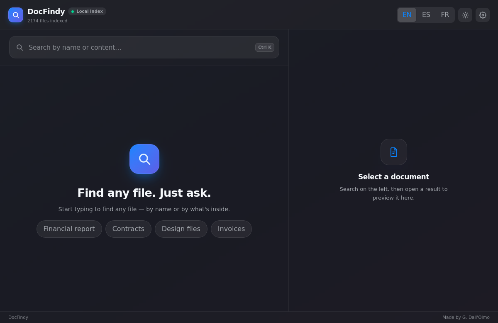
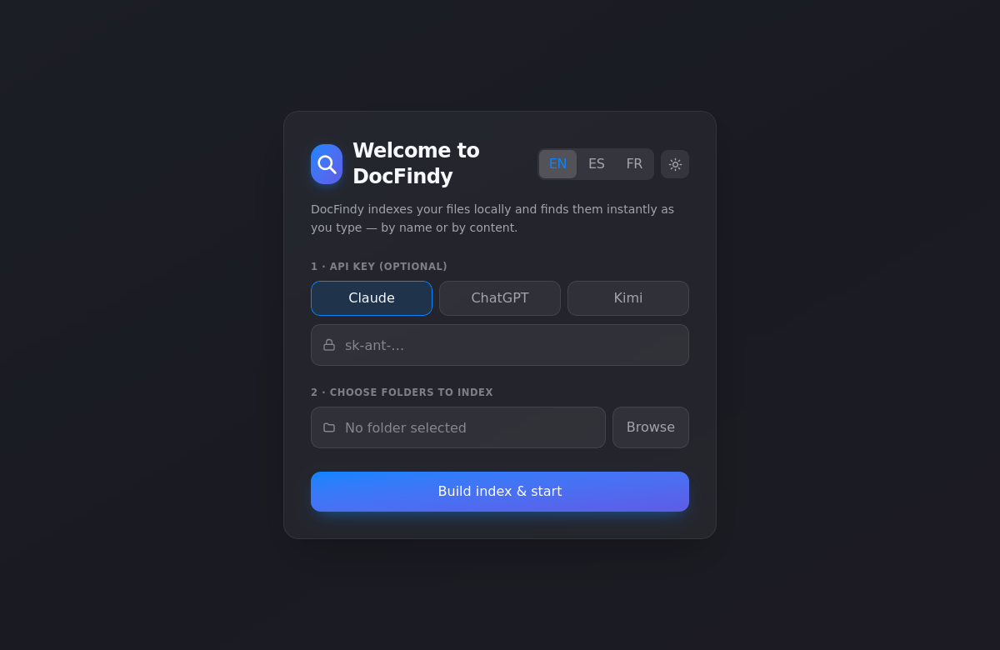
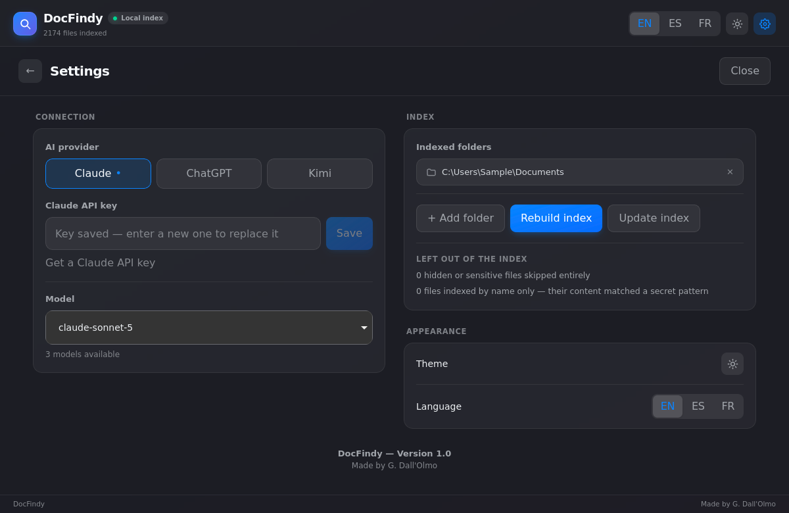
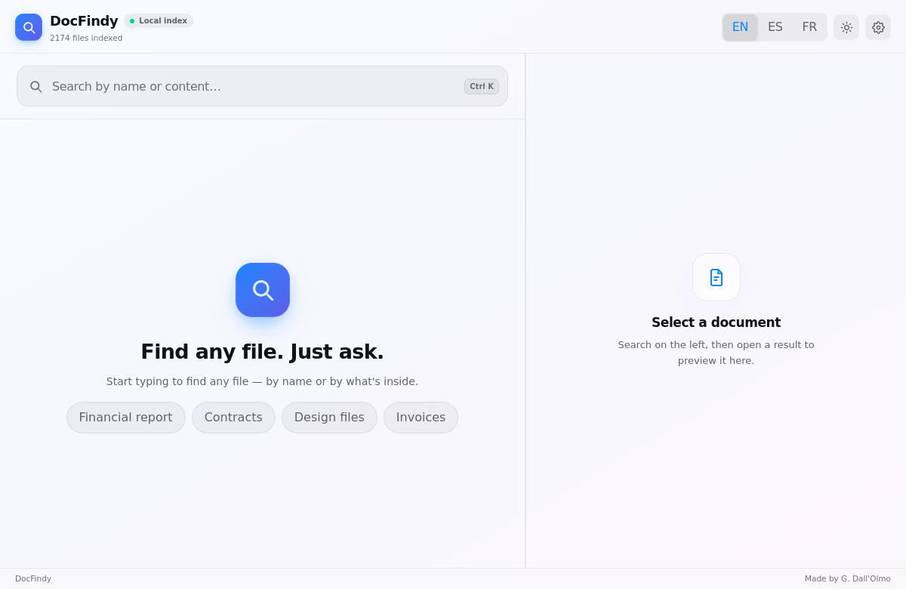

# DocFindy

Desktop file finder that searches **inside** your documents, not just their names. Type a word and it finds the PDF, Word file or note that contains it — instantly, locally, with no cloud upload. An optional API key — Claude, ChatGPT or Kimi, your pick — adds AI summaries, document Q&A and synonym-aware search.



## What it does

- **Search by content, not just filename.** SQLite FTS5 index, accent-insensitive (`resume` matches `résumé`), BM25-ranked. Text is extracted from **pdf, docx, odt** and plain-text formats (txt, md, csv, json, yaml, and common code extensions). Other indexed types — doc, rtf, epub, xlsx, pptx, images, audio, video — are searchable **by filename only**.
- **Instant, as you type.** The plain search path never calls a network service, so results appear while typing.
- **Local by default.** The index lives on your machine. Files are never uploaded anywhere unless you explicitly use an AI feature, which sends only the relevant document text.
- **Skips your secrets.** `.env*`, `id_rsa`, `id_ed25519`, `.pem`, `.key`, `.kdbx`, `.pfx`, `.p12`, `.ppk` are never indexed. System directories (`Windows`, `Program Files`, `AppData`, `$Recycle.Bin`, …) and dev noise (`node_modules`, `__pycache__`, `site-packages`, dot-directories) are skipped too.
- **Rich previews.** Documents render in place — docx keeps its formatting, tables and images — with quick actions to open the file or reveal it in your file manager.
- **Favourites.** Pin the files you keep coming back to.
- **Keyboard-driven.** `↑`/`↓` to move through results, `Enter` to open the selected one.
- **Light and dark themes**, plus a **trilingual UI** (English, Spanish and French), both switchable at runtime.

With an API key you also get: an on-demand AI summary of the previewed document, ask-a-question about the open document, and smart search that expands your query with synonyms and FR/EN translations before hitting the index.

**Bring your own provider.** Claude, ChatGPT or Kimi — pick one in Settings (or right from the welcome screen) and paste that provider's key. Each key is stored separately, so switching provider does not make you re-enter the other one. The model list is fetched from the provider itself, so a newly released model is selectable without waiting for a DocFindy update.

**The API key is optional.** Without it, indexing, search, preview and open all work; AI actions remain visible but ask you to configure a key when used.

## Screenshots

### First run

Pick the folders to index. The API key field can be left empty — and if you hold keys for several providers, you can enter them all here: each tab keeps what you typed.



### Settings

A full screen, not a dialog. Choose the AI provider, store its key, and pick a model from the list the provider reports.



### Light theme

Dark by default, light on demand — the toggle sits next to the language switch.



## Install

### Windows

Grab the installer from the [releases page](https://github.com/Guillaume-da/docfindy/releases). Windows 10 or 11, **x64 only**. Everything is bundled — no Python or Rust needed on the target machine. If the WebView2 runtime is missing, the installer fetches it, so that step needs a connection; Windows 11 ships it already.

Builds are **not code-signed**, so Windows reports "Unknown publisher" and SmartScreen may block the download — *More info → Run anyway*. Each release carries a SHA-256 checksum so you can verify what you downloaded.

### Build from source

Prerequisites: Rust, Node 18+, Python 3.10+, and the [Tauri system dependencies](https://tauri.app/start/prerequisites/) for your platform.

```bash
git clone https://github.com/Guillaume-da/docfindy.git
cd docfindy

python3 -m venv engine/.venv
engine/.venv/bin/pip install pypdf

scripts/dev-sidecars.sh   # sidecar shims for your host triple (untracked)

npm install
npm run tauri dev      # development
npm run tauri build    # production bundle
```

## How it works

| Layer | Role |
|-------|------|
| **Tauri 2** (Rust) | App shell, model-provider clients with a tool-use loop, OS keychain access, sidecar orchestration |
| **docfindy-engine** (Python sidecar) | Walks the chosen roots, extracts text from pdf/docx/odt/plain files, maintains the SQLite FTS5 index. Only dependency: `pypdf` |
| **rtk** (Rust sidecar) | [Rust Token Killer](https://github.com/rtk-ai/rtk) — compresses filesystem probe output before it enters the model context (60-90% fewer tokens) |
| **caveman** | [Terse-output prompt rules](https://github.com/JuliusBrussee/caveman) baked into the agent system prompt (~65% fewer output tokens) |
| **React 19 + Tailwind 4** | Search UI, rich preview pane, theme and EN/ES/FR toggles |

The frontend can also run standalone in a browser: `src/dev/tauri-mock.ts` stubs the Tauri commands with sample data, which is handy for UI work without a Rust rebuild.

```bash
VITE_MOCK=1 npm run dev
```

Add `?mock=fresh` to the URL to get the first-run state (empty index) instead of
the seeded one.

The screenshots in this README are regenerated from that mocked UI, through
WebKitGTK — the engine the Linux build ships with, so they show the real thing:

```bash
VITE_MOCK=1 npm run dev              # terminal 1
python3 docs/screenshots/capture.py  # terminal 2
```

### Agent tools

When the AI agent runs, it has these tools available:

| Tool | Purpose |
|------|---------|
| `doc_search` | FTS5 full-text search over names + content — the primary search tool |
| `fs_probe` | rtk-compressed filename scan, used as a fallback |
| `content_search` | Literal term lookup with exact line/page locations |
| `read_file` | Text extraction (txt/code/pdf/docx/odt) for syntheses |
| `show_file` | Display a file in the preview pane |

### Engine CLI

The sidecar is a plain JSON-over-stdout CLI and can be driven directly, which is handy for debugging:

```bash
engine/.venv/bin/python engine/main.py build  --out <index-dir> --path ~/Documents
engine/.venv/bin/python engine/main.py fts    --out <index-dir> --query "budget"
engine/.venv/bin/python engine/main.py detect --path ~/Documents
```

Subcommands: `detect`, `build`, `update`, `text`, `blocks`, `search`, `fts`.

In development, the shims written by `scripts/dev-sidecars.sh` into
`src-tauri/binaries/` forward to `engine/.venv`. That directory is not tracked:
`externalBin` bundles whatever it finds there, and a dev shim is not something
to ship. Release builds stage the real binaries in CI.

Override the resolved engine with:

```bash
DOCFINDY_ENGINE="/path/to/python /path/to/main.py" npm run tauri dev
```

The variable is read in debug builds only — in a shipped binary it would turn
"can set this app's environment" into arbitrary code execution.

## Configuration & data

| What | Where |
|------|-------|
| API keys | One per provider, in the OS keychain (Windows Credential Manager, macOS Keychain, Secret Service), with a `0600` file fallback in the config dir for headless/WSL setups |
| Settings | `<config>/com.guillaume.docfindy/settings.json` — includes the chosen provider and a model per provider |
| Endpoint override | `DOCFINDY_ANTHROPIC_BASE_URL`, `DOCFINDY_OPENAI_BASE_URL`, `DOCFINDY_KIMI_BASE_URL` — for `api.moonshot.cn` or an OpenAI-compatible gateway |
| Index | `<data>/com.guillaume.docfindy/graphify-out/content.db` + `files.json` |

On Linux that resolves to `~/.config/…` and `~/.local/share/…`; on Windows to `%APPDATA%`.

> `graphify-out` is a historical directory name from an earlier iteration of the project. It is only a path, and renaming it would move every existing user's index, so it has been left alone for now.

### Migration from Findy

The app was renamed from Findy to DocFindy. That changed the bundle identifier, which in turn changed both paths above **and** the keychain service name — so without help, an upgrade would silently lose settings, the whole index and the stored API key.

`src-tauri/src/migrate.rs` runs at startup and moves all three from the old `com.guillaume.findy` names. It merges entry by entry rather than moving whole directories, because the webview creates its own caches under the new identifier before the migration runs. It is a no-op on fresh installs and after the first successful run, and if a move fails the old data is left in place rather than half-copied.

## Security

DocFindy reads your documents and can hand their text to an AI, so a few things
are worth stating plainly.

**Where your data goes.** Indexing, search, preview and open are entirely local
— nothing leaves the machine. The AI features (summary, document Q&A, smart
search) send the relevant document text to the Anthropic API, and only when you
invoke them. Without an API key the app still works; those panels are hidden.

**What is never indexed.** Credential-shaped files — `.env*`, SSH keys,
`.pem`, `.key`, `.kdbx`, `.pfx`, `.p12`, `.ppk`, `.jks`, `.gpg`, `.asc`, and
whole names like `credentials`, `.netrc`, `.npmrc`, `.pgpass`, `wallet.dat` —
are skipped, along with anything under `.ssh`, `.aws`, `.gnupg`, `.docker`,
`gcloud` or `.azure`, system directories and dev noise (`node_modules`,
`__pycache__`, dot-directories).

**Agent confinement.** The agent picks what to read partly from document text it
was just given, which makes a hostile document a prompt-injection vector. *All
five* of its file tools resolve every path against your indexed roots *after*
canonicalisation, so `..` and symlinks cannot escape, and refuse
credential-shaped paths on read as well as at indexing time. The engine sidecar
applies the credential rule again on its own, so it is safe even when driven
directly. The system prompt states that file contents are data, never
instructions — but the tools, not the prompt, are what enforces this.

**Webview confinement.** The `asset:` protocol scope starts empty and is
widened at runtime to exactly the indexed roots, so the frontend cannot render
a file the commands would refuse to open. The CSP allows no outbound
connections beyond the IPC channel (`connect-src 'self' ipc:`), which means
document text pulled into the page has nowhere to be sent.

**Where the API key lives.** OS keychain first (Windows Credential Manager,
macOS Keychain, Secret Service). The file fallback is only used when that
fails: `0600` on Unix; on Windows it inherits the config directory ACL, which
is per-user but not an equivalent — treat that path as the weaker one.

**Dependency advisories** are checked in CI (`.github/workflows/audit.yml`) by
`npm audit` and `cargo audit`, weekly and on every push.

Found something? Open an issue — or, for anything exploitable, please report it
privately through GitHub Security Advisories rather than in a public issue.

## Windows installer build

`.github/workflows/build-windows.yml` builds, on a `v*` tag or manual dispatch:

1. `docfindy-engine.exe` — PyInstaller onefile
2. `rtk.exe` — `cargo install`
3. The NSIS installer — `tauri build`

Artifact: `docfindy-windows-installer`.

## Troubleshooting

**Nothing is found even though the file exists.** Check that its folder is in your indexed roots (⚙ → folders), and that the file type is supported. Rebuild with ⚙ → rebuild index after adding folders.

**AI actions report that no key is configured.** Add one in ⚙ for the provider you selected — keys are per provider, so a Claude key does not cover ChatGPT. Instant search works without any key.

**The model list will not load.** It is fetched from the provider, so it needs a saved, valid key and network access. When it fails the field falls back to free text — type the model id and it is used as-is.

**Blank window or GPU warnings on WSL.** WSLg has no working DRI3 device. Run with software rendering:

```bash
WEBKIT_DISABLE_DMABUF_RENDERER=1 WEBKIT_DISABLE_COMPOSITING_MODE=1 npm run tauri dev
```

**Engine not found.** In development the shims expect `engine/.venv`. Create it as shown above, or point `DOCFINDY_ENGINE` at your interpreter.

## Project layout

```
engine/          Python indexing sidecar (main.py, engine.spec)
src/             React frontend (components/, i18n/)
src-tauri/src/   Rust core
  agent.rs         Tool-use loop and prompts, provider-agnostic
  provider.rs      Claude / ChatGPT / Kimi clients (two wire formats)
  commands.rs      Tauri commands exposed to the frontend
  engine.rs        Sidecar resolution and execution
  migrate.rs       Pre-rename data migration
  secrets.rs       Keychain + file fallback
  rtk.rs           rtk-compressed filesystem probe
docs/screenshots/  README images + capture.py that regenerates them
```

---

Made by G. Dall'Olmo.
